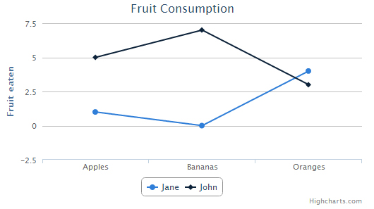
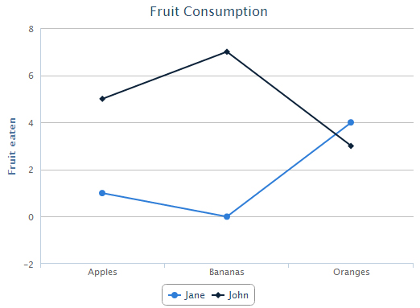
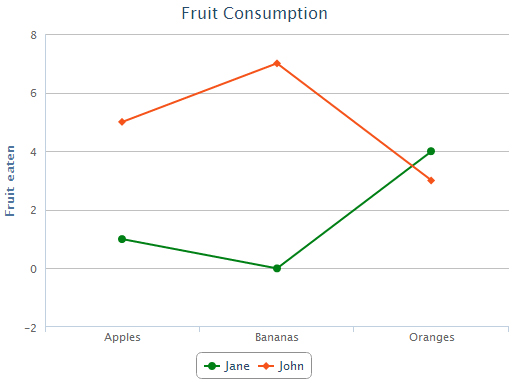
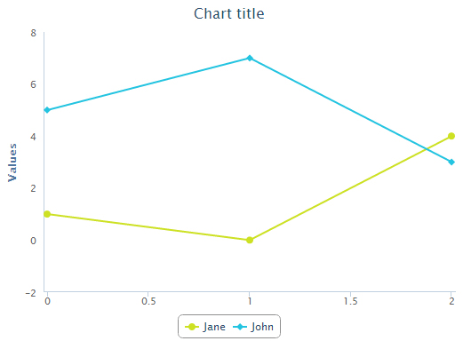

# Graphs Implementation

As we are all went through some of the projects in which graph for data representation has been used, and we usually left that graph implementations on
developers end. So to fasten up the development process we can also implement the graphs by ourselves,
just need to use some jQuery code and modify it as per our need. Let’s have a look to the process.
## Implementing Graph Plug-in:
There are lots of plug-in for the implementations of the graphs are available on the net, but there is one graph plug-in which has its own full
development organization and very much extensible and customizable this is ‘Highcharts js’.

## Why Highcharts js?
The reason why I chose highcharts or suggest to use highcharts in the projects:

• Supports all kinds of graphs( line, spline, area, areaspline, column, bar, pie, scatter, angular gauges, arearange, areasplinerange, columnrange, bubble, box plot, error bars, funnel, waterfall and polar chart) .

• Highly rich and customizable.

• Support till IE-6+ as uses VML(Vector Markup Language) rendering (which is very important, from our point of view).

• Easily supportive with the php or any other programming language.

• Written in HTML5/Javascript, so very fast in rendering.

• Support for Android2.x +

So, we are going to see the graph implementation of Basic Line and Pie Chart (Doughnut chart).

##Let’s start with the Basic Line Graph
### 1)Installation
Just download the highchart.js and J-Query version 1.4.3+ and put on your webpage.
```html
    <script src="/js/jquery.min.js"></script>
    <script src="/js/highcharts.js"></script>
```

### 2)Creating Chart
a)Add a div in the page. Give it the attribute id and set its specific width and height.
```html
    <div id=”lineGraph” style=”width: 500px; height 400px;”></div>
```
b)Now initialize the chart inside the javascript tag anywhere in a webpage inside the document.ready function.
Now there are two ways of initializing the chart.
i) One using the id and call the highchart functions, and
ii) Second create a new object of the highchart using constructor Highcharts.Chart.

Let’s see the examples of both ways.
#### Using id:
```html
	<script>
        $(document).ready(function(){
            $(function () {
                $('#container').highcharts({
                    chart: {
                        type: 'line'
                    },
                    title: {
                        text: 'Fruit Consumption'
                    },
                    xAxis: {
                        categories: ['Apples', 'Bananas', 'Oranges']
                    },
                    yAxis: {
                        title: {
                            text: 'Fruit eaten'
                        }
                    },


                    series: [{
                        name: 'Jane',
                        data: [1, 0, 4]
                    }, {
                        name: 'John',
                        data: [5, 7, 3]
                    }]
                });
            });
        });
	</script>
```
#### Using Constructor Highcharts.Chart:
```html
    <script>
        $(document).ready(function(){
            $(function () {
                var lineChart = new Highcharts.Chart({
                    chart: {
                          type: 'line'
                    },
                         // same as the above code//
                });
            });
        });
    </script>
```

#### The above code will render like this:


The second method is used basically when we use Moo Tools or Prototype, instead of $(function() syntax.
###for example:
#### MooTools
```html
    <script>
        $(document).ready(function(){
            window.addEvent('domready', function() {
               var chart1 = new Highcharts.Chart({
                  chart: {
                     renderTo: 'container',
                     type: 'bar'
               ...
            });
        });
    </script>
```
#### Prototype
```html
    <script>
        $(document).ready(function(){
            document.observe("dom:loaded", function() {
               var chart1 = new Highcharts.Chart({
                  chart: {
                     renderTo: 'container',
                     type: 'bar'
               ...
            });
        });
    </script>
```

## What is Option Object?
When you initialize the chart using its constructor Highcharts.Chart, the options object is the first parameter you pass.

###Let’s see the basic x-axis value modifications:-
#### X-Axis Modifications:
1) Setting up the x-axis value(categories):
Default Values: 0 2 4….
Now we can set this x-axis value or categories by passing the values to the categories array:
```html
    <script>
        $(document).ready(function(){
            $(function () {
                var lineChart = new Highcharts.Chart({
                 xAxis: {
                                categories: ['Apples', 'Bananas', 'Oranges']
                            },
                  credits: {
                            enabled : false
                   }
                });
            });
        });
    </script>
```
###Let’s see what basic modification we can do in Graph regarding look and feel:-
#### Removing the Highchart.com add in right-Bottom of graph:
As we can see on the above graph there is advertisement of graph coming on the right-bottom side of graph.
In graph that is called the credit. So, if we want to remove that credits then we have to false the credit option.
```html
    <script>
        $(document).ready(function(){
            $(function () {
                var lineChart = new Highcharts.Chart({
                   credits: {
                            enabled : false   // this line will hide the highchart.js Ad from bottom-right corner.
                   }
                });
            });
        });
    </script>
```
#### Giving visibility to the y-axis line;
In the above example we can see that the y-axis values don’t have the vertical line, it is because the lineWidth option of the line on y-axis has zero value,
we can give it a value to make it visible. Remember right now we are modifying the y-axis property so the lineWidht property will be in the y-axis scope,
lets see:
```html
    <script>
        $(document).ready(function(){
            $(function () {
                var lineChart = new Highcharts.Chart({
                   credits: {
                            enabled : false
                   },
                   yAxis: {
                         lineWidth: 1
                   },
                });
            });
        });
    </script>
```
#### The above code will render like this:


You can see now there is a y-Axis line has come and making the credits options false we have hid the highcharts advertise.

#### Giving color to the graph lines:
The color which is visible right now for the lines is default color given by the Highcharts. Now how to change the line color?
There are two ways of giving the color by using global object options or by individually giving color to the lines. Let’s check the both options:

a) Global Declaration:
```html
    <script>
        $(document).ready(function(){
            Highcharts.setOptions({
                            colors:['#008015', '#f5531a']
                    }); // global declaration of the color

            $(function () {
                var lineChart = new Highcharts.Chart({
		   chart:{
                        renderTo:'basicLineChart',
                        type:'line'
                    },
                   credits: {
                            enabled : false
                   },
                   yAxis: {
                         lineWidth: 1
                   },
                   series: [{
                          name: 'Jane',
                          data: [1, 0, 4]
                  }, {
                          name: 'John',
                          data: [5, 7, 3]
                  }]
                });
            });
        });
    </script>
```
Now above global declaration will apply on every chart lines as we have defined two colors in the variable now that two colors will apply on the first two
data on the series options respectively.

#### The above code will render like this:


b) Indiviual Declaration:
```html
    <script>
        $(document).ready(function(){
            Highcharts.setOptions({
                            colors:['#008015', '#f5531a']
                    }); // global declaration of the color

            $(function () {
                var lineChart = new Highcharts.Chart({
		   chart:{
                        renderTo:'basicLineChart',
                        type:'line'
                    },
                   credits: {
                            enabled : false
                   },

                   yAxis: {
                         lineWidth: 1
                   },
                   series: [{
                          name: 'Jane',
                          data: [1, 0, 4],
                         color: '#cde123'
                  }, {
                          name: 'John',
                          data: [5, 7, 3],
                          color: '#23c4e1'
                  }]
                });
            });
        });
    </script>
```
Now here I have defined the particular line color inside the series options separately. Now this declaration will override the global color declaration.

#### The above code will render like this:


#### How to remove the graph background
Now here you can see that a horizontal line behind the graphs line are coming, so this is the default background of the graph lets see how to remove it!
Just add a property(option) 'gridLineWidth:0' in the yAxis: object.
```html
    <script>
        $(document).ready(function(){
            $(function () {
                var lineChart = new Highcharts.Chart({
		   chart:{
                        renderTo:'basicLineChart',
                        type:'line'
                    },
                   credits: {
                            enabled : false
                   },

                   yAxis: {
                         lineWidth: 1,
			 gridLineWidth: 0
                   },
                   series: [{
                          name: 'Jane',
                          data: [1, 0, 4],
                         color: '#cde123'
                  }, {
                          name: 'John',
                          data: [5, 7, 3],
                          color: '#23c4e1'
                  }]
                });
            });
        });
    </script>
```
#### The above code will render like this:



#### How to add Image to your graph.
It is possible that sometimes we will get the requirement to add the image to our graph to show some changes or make our graph more interactive. Lets see how we can achieve that requirement. We have to do certain things:
1) First call the event option inside the chart object
2) In that event option we have to render that image (call that image with absolute path) inside a function, lets see the syntax:

Assume in the above graph we are showing a image of Green Line.

```html
    <script>
        $(document).ready(function(){
            $(function () {
                var lineChart = new Highcharts.Chart({
		   chart:{
                        renderTo:'basicLineChart',
                        type:'line',
			events: {
                 	    load: function () {
                        	  this.renderer.image('image/lineGraphPath.png',250, 12, 11, 259)// (left, top, width, height) these are the values passed.
      		                  .add();
                     		}
                	}
                    },
                   credits: {
                            enabled : false
                   },

                   yAxis: {
                         lineWidth: 1,
			 gridLineWidth: 0
                   },
                   series: [{
                          name: 'Jane',
                          data: [1, 0, 4],
                         color: '#cde123'
                  }, {
                          name: 'John',
                          data: [5, 7, 3],
                          color: '#23c4e1'
                  }]
                });
            });
        });
    </script>
```
#### The above code will render like this:


you can see the green line with top arrow is coming inside the graph

### To be continued...........
####precap:-
1) How to hide and show the graph lines on external click events.

