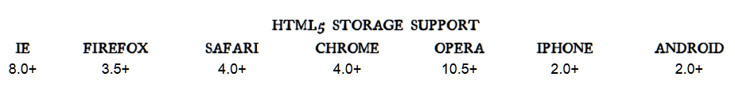

# HTML5 Local Storage / Web storage

Web storage and DOM storage (document object model) are web application software methods and protocols used for storing data in a web browser.
Web storage supports persistent data storage, similar to cookies but with a greatly enhanced capacity and no information stored in the HTTP request header.
There are two main web storage types: local storage and session storage, behaving similarly to persistent cookies and session cookies respectively.

Like cookies, this data persists even after you navigate away from the web site, close your browser tab, exit your browser, or what have you.
Unlike cookies, this data is never transmitted to the remote web server (unless you go out of your way to send it manually).
Unlike all previous attempts at providing persistent local storage, it is implemented natively in web browsers,
so it is available even when third-party browser plugins are not.

### Which browsers? Well, the latest version of pretty much every browser supports HTML5 Storage… even Internet Explorer!

